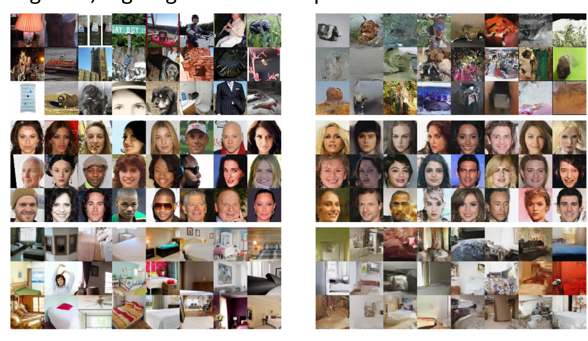
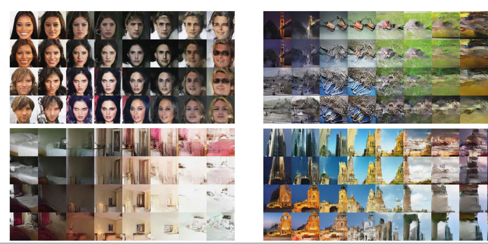
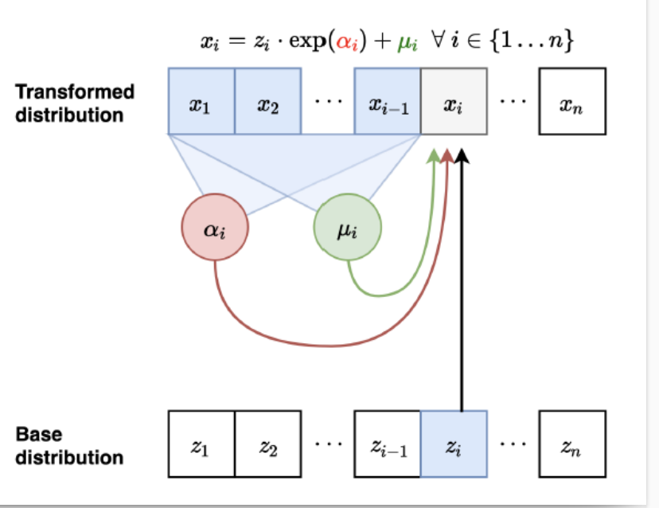
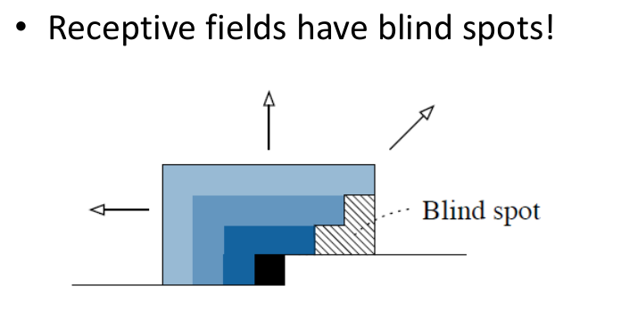
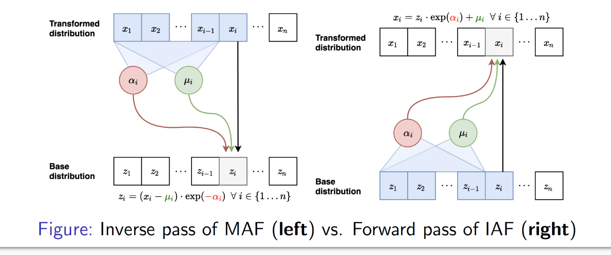
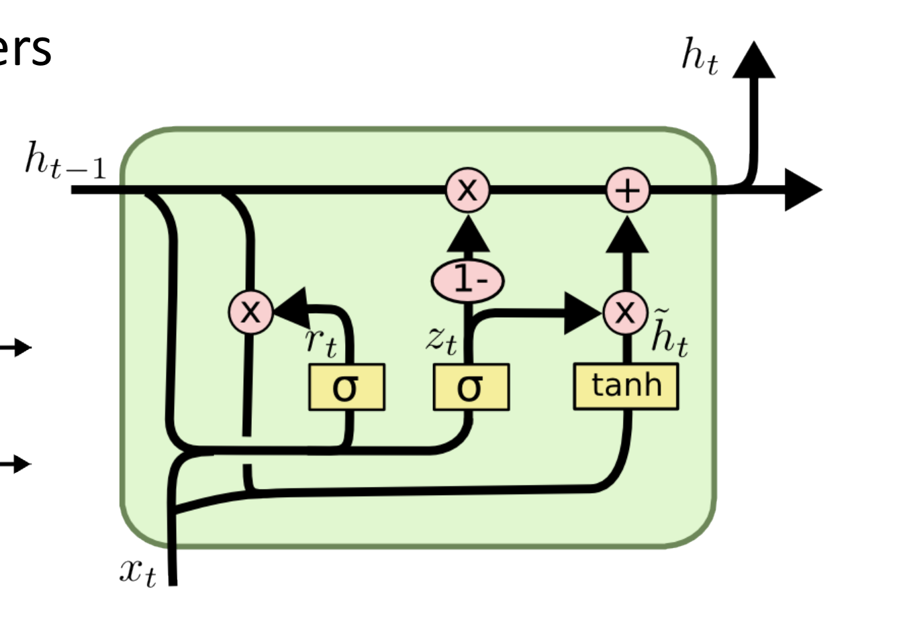

# Deep Learning Lecture Notes

## 0. Introduction

### 0.1 General Introduction Of Deep Learning
> Deep Learning is a class of machine learning methods that use neural networks to learn representations from raw data.

什么是 deep learning? 简单的说， deep learning 是利用深度神经网络学习数据的表示的一种机器学习方法。这里的“深度”指的是神经网络的层数，而“学习数据的表示”指的是神经网络的参数，也就是说，我们通过调整神经网络的参数来学习数据的表示。
> There're two kinds of model, one is the discriminative
> model from $X$ to $Y$, the other is the generative model
> from $Y$ to $X$.(Yi Wu)

更加数学化地，我们有一个目标函数$f$,而我们希望用一个带参数的神经网络$NN_\theta$去拟合$f$，使得$NN_\theta(x) \approx f(x)$,这就是深度学习想做的事情，而找到这个$\theta$的过程就是 ~~炼丹~~ 训练(train)。

根据所学习的$f$的不同，我们可以把任务分成两类，从而对应两类不同的模型：生成式模型(Generative Models)和判别式模型(Discriminative Models)。例如，当数据是手写数字的图片时，生成式模型的目标是给定一个数字，生成一张图片，而判别式模型的目标是给定一张图片，判断这张图片是什么数字。

这两者在数学上的本质区别实际上是$f$的性质，判别式模型学习的$f$ 是一个**映射**$f(x)=y$,也就是说给定一个$x$(一般称作data),我们就有唯一对应目标的$y$(一般称作label,或许你会说对于噪声图片$x$似乎也没有我们想要对应的$y$，但是这里的讨论中，把定义域先当成我们想要的图片(训练图片，测试图片...))，而生成式模型则是给定$y$,希望输出一个$x$,学习的是**映射的"反函数"**$f^{-1}(y)=x$.(也许追求严谨的人到这里已经看不下去了，但别急，后面有详细的解释)

到这里，你可能会发现我们一直在回避一个定义上的问题，这个函数的定义域和值域究竟是什么？还是回到手写数字-标签的例子，对$y$的值域$Y$这是简单的，就是所有标签的集合，而对于$x$的定义域，事实上，作为一个神经网络，它可以接受的$x$自然是所有可能图片的集合，然而我们并不关心它在大多数噪声图片上的表现，而是只关心我们想要的真正的数字图片的识别效果，也就是说，加入我们把所有图片的集合设为$\Omega$,那我们关心的只是$\Omega$的一个小子集$X_0$,代表所有手写数字的图片的集合。

对于判别式模型, 我们希望$NN(x)\approx f(x)(x\in X_0$).

$X_0$究竟是什么呢?我们可以发现这和我们任务的定义有关，并没有数学上严格的说法。我们有什么？一般来说，我们有一个由一些满足$f(x)=y$的$(x,y)$构成的训练集$P$, 并且可以确定的是，$P$中的$x$一定被$X_0$包含，而我们凭借训练数据也知道不了更多了！所以，事实上，神经网络的训练只是关心$NN(x) \approx f(x) (x\in P)$, 而我们默认了$X_0$ 有一些比较好的内在的性质，使得这可以让$NN(x) \approx f(x) (x\in X_0)$也成立。这称为泛化能力(Generalization Ability)。 

这个假设在数学上一般当然不成立，我们称满足$NN(x) \approx f(x) (x\in P)$ 但是不满足$NN(x) \approx f(x) (x\in X_0)$的现象为过拟合(Overfitting),而研究如何避免过拟合是判别式模型训练的重要内容,对于模型泛化能力的研究也是
深度学习理论研究的重点防线之一。你或许已经可以在上面我们问题的表述中想到一点如何避免过拟合的想法，我们将在下面的章节中详细讨论。

> “或许你overfit的模型，学到的正是某个平行世界中的特征”(Yao Seminar)

对于生成式模型，定义就更加模糊了。Generally speaking, 我们希望找到$NN$,使得给定$y$,我们可以生成一个$NN(y) = x$, 使得 $x \in X_0$, 并且 $f(x) = y$. 

此时，我们的$P$可以和之前一样，是满足$f(x) = y$并且 $x \in X_0$的$(x,y)$, 但我们注意到这个时候没有标签的$x \in X_0$也有了意义，因为我们可以通过它学到$X_0$的信息！所以，根据训练数据是否有标签，我们可以把生成式模型的训练分成有监督(supervised learning),无监督(unsupervised learning)和半监督(semi-supervised learning)三种情况,分别对应数据全部有标签，全部无标签和部分有标签的情况。(显然，对于无监督情况，我们不能完成给定标签的生成)

当然，上面关于目标的定义显然可以找到很多cheat的方法，例如直接从训练集中找一张符合要求图片输出就可以达到目标，所以这里就涉及到评判模型好坏的标准了。

我们先说比较简单的评判判别式模型好坏的方法，一般来说是找$X_0$的另一个子集$P'$,称为测试集,然后用$NN(x)$和$f(x)$在$P'$上的差距来衡量，
而有一些大家都认可的测试集，从而可以比较大家生成模型的好坏。

然而，对于生成式模型，就没那么简单了，首先$X_0$没有明确数学定义，而
在判别式模型里我们只需要一个公认的$X_0$的子集就行了，但在生成式模型里，我们似乎一定得搞明白$X_0$究竟是什么！于是，这导致生成式模型到现在也没有一个universal的标准，而对于不同的生成式模型，我们也会有不同的评判标准，这在后面会详细讨论。但回到我们关于$X_0$的定义，不就是“手写数字”的集合的主观定义嘛！所以有一个“耍赖”的评判标准——直接主观判断！这也是为什么许多生成式模型的论文里，往往会放很多生成的图片的原因，这也确实在某种方面上更加有说服力。

### 0.2 Training

深度学习发展至今，对于给定的网络结构，如何训练网络已经有了很多成熟的方法，其中的核心就是优化理论中的重要算法:梯度下降。

于是，模型的训练现在以及变成了一个程序化的过程:
- 1.定义模型结构
- 2.定义一个损失函数，表示模型的好坏
- 3.定义一个基于梯度下降的优化算法，使得损失函数最小化
- 4.根据算法优化损失函数，得到最终模型

所以，对于任何一个任务，我们就分成了四个步骤，而这四个步骤中的每一步都非常重要，直接关系到最终生成的结果。我们之后对于模型的介绍也基本会按照这个框架来进行。对于第三步，由于它和模型无关，所以我们会在下面先做讨论，对之后的所有模型，方法都是类似的。

### 0.3 Gradient Descent

#### 0.3.1 GD

当然，最简单的办法就是直接用梯度下降，也就是说，我们直接计算损失函数对于参数的梯度，然后按照梯度的方向更新参数。这个方法的优点是简单直接，但对于大多数情况来说，根本不现实，大部分训练集的规模都是非常大的，而计算梯度的时间复杂度也不低。

#### 0.3.2 SGD

于是，我们引入了SGD(Stochastic Gradient Descent),也就是说，我们不是计算整个训练集的梯度，而是每次只取数据集的一部分，称为一个batch，计算这个batch的梯度，然后更新参数。这样做可以显著减少计算量，这也是深度学习中常见的优化算法。(事实上，人们后来发现，SGD因为内在的随机性，还可以有效减轻过拟合问题)

实际应用中，为方便起见，一般都是直接把整个测试集分成若干个batch，然后每次取一个batch进行训练，对所有batch训练完一遍称为一个epoch，然后重复若干个epoch直到收敛。**之后的所有优化算法都是基于SGD的改进，核心思想都是通过减小震荡，加快收敛,具体的数学表达式可能比较复杂或者奇怪，而数学上的严格证明也大多和实际应用有一定的差距，所以我们在这里只做简单的介绍。~~不想看可以直接跳到下一节~~**

SGD的数学表达式可以写成这样:$$\theta_{t+1}=\theta_t-\eta \nabla \mathbb{E}_{x \sim B}[L(\theta_t, x)]$$,
其中$B$是一个batch, $\eta$是学习率，$L$是损失函数。

#### 0.3.3 Momentum

然而，SGD有一个问题，就是在到达最优点的时候，由于梯度的方向不断变化，可能会导致震荡，于是，我们引入了Momentum,也就是说，我们不仅仅考虑当前的梯度，还考虑之前的梯度，这样可以减小震荡，加快收敛。

Momentum的数学表达式可以写成这样:$$v_{t+1}=\gamma v_t+\eta \nabla \mathbb{E}_{x \sim B}[L(\theta_t, x)]$$
$$\theta_{t+1}=\theta_t-v_{t+1}$$
其中$\gamma$是一个超参数，一般取0.9左右。(超参数指的是不通过训练得到的参数，而是需要人为设定的参数，区别于神经网络的参数)

#### 0.3.4 Adam(Adaptive Moment Estimation)

Adam是一种结合了SGD和Momentum的优化算法，它的优点是可以自适应地调整学习率，从而可以更好地适应不同的数据集。

Adam的数学表达式可以写成这样:$$m_{t+1}=\beta_1 m_t+(1-\beta_1)\nabla \mathbb{E}_{x \sim B}[L(\theta_t, x)]$$
$$v_{t+1}=\beta_2 v_t+(1-\beta_2)(\nabla \mathbb{E}_{x \sim B}[L(\theta_t, x)])^2$$
$$\hat{m}_{t+1}=\frac{m_{t+1}}{1-\beta_1^{t+1}}$$
$$\hat{v}_{t+1}=\frac{v_{t+1}}{1-\beta_2^{t+1}}$$
$$\theta_{t+1}=\theta_t-\eta \frac{\hat{m}_{t+1}}{\sqrt{{\hat{v}_{t+1}}+\epsilon}}$$
其中$\beta_1,\beta_2$是超参数，$\epsilon$是一个很小的数，一般取$10^{-8}$左右。

## 1. Discriminative Model

### 1.1 Structure & Loss Function

回顾我们的目标,我们希望找到$NN_{\theta}$,使得$NN_{\theta}(x) \approx f(x) (x\in X_0)$, 而我们有一些训练数据$P:\{(x,y)\}$,满足 $y=f(x)$. 于是，我们先训练$NN_{\theta}$,使得$NN_{\theta}(x) \approx f(x) (x\in P)$. 然而，对于离散的label,我们很难定义一个比较好的可以求导的损失函数，于是我们引入一个重要的思想:让我们的$NN_{\theta}$对每个标签生成一个概率$p_{\theta,y}(x)$，而我们的目的则变为找到$\theta$使得$p_{\theta,f(x)}(x)$尽可能接近$1$.

于是，这就引出了我们的损失函数的定义:交叉熵(cross-entropy)损失函数:
$$L(\theta)=-\frac{1}{|P|}\sum_{(x,y)\in P}\log p_{\theta,y}(x)$$

(对于一般的两个概率分布$p,q$,交叉熵定义为$H(p,q)=-\sum_x p(x)\log q(x)$,而上面的损失函数就是$p$与一个$f(x)$处单点分布的交叉熵)

### 1.2 Layers

说了这么多，$NN$的结构究竟是什么样？事实上，$NN$的结构是非常灵活（你也可以发明你想要的结构！），这里我们介绍一些常见的结构和它们的特点

#### 1.2.1 Fully Connected Layer & Activation Function

最常见的结构就是全连接层，它的数学表达式可以写成:
$$f: \mathbb{R}^n \rightarrow \mathbb{R}^m, f(x)=\sigma(Wx+b)$$

其中$W \in \mathbb{R}^{m \times n}, b \in \mathbb{R}^m$. 全连接层十分灵活，并且具有很强的表达能力（拟合各种函数的能力），同时可以很方便地进行维度的转换，许多简单的判别任务仅通过全连接层（和马上要说的）激活函数就可以达到比较令人满意的效果。

激活函数$\sigma$是全连接层的重要组成部分，很容易证明，如果没有激活函数的话，事实上多少个全连接层复合都和一个没有区别，并且最终得到的是一个线性的函数，这大多数时候是不够的。(大多数判别任务并没有线性的特征！例如数字识别，把两个0的图片加起来取平均，得到的标签可能是8)常见的激活函数有$sigmoid(x) = \frac{1}{1+e^{-x}}, tanh(x)= \frac{e^x-e^{-x}}{e^x+e^{-x}}, ReLU(x)=\max(0,x)$等等，在不同的任务中，不同的激活函数可能会有不同的效果。

#### 1.2.2 Convolutional Layer
全连接层表达能力非常强，但是，它也存在两个缺点：首先，由于向量的维度一般很大，所以参数量也很大，导致训练时间长；其次，全连接层没有用到数据的任何特点，而是只看成一个向量，这可能会导致过拟合的问题，并且也会浪费我们所知道的关于$f$的某些信息
所以，对于图片类型的数据（这也是深度学习主要应用之一），我们想要引入一个新的结构，这就是卷积层。

卷积层的intuition来自两个观察:首先，对图片，$f$具有一个很好的性质,那就是平移不变性（想象把一张数字2平移1个像素，它仍然是2,并且人眼几乎看不出区别，但如果转化成向量以后，这两个向量也许完全不同）；其次，来自于人判断图片的方式：根据局部的特征来判断图片的内容。于是，我们引入卷积层来获得图片的局部特征。

卷积层的数学表达式可以写成:
$$f: \mathbb{R}^{C_1\times n\times m} \to \mathbb{R}^{C_2\times n'\times m'} $$ 
$$f(x)_{c_2,i,j} = \sum_{k=1}^{k_1}\sum_{l=1}^{k_2}W_{c_1,c_2,k,l}x_{c_1,i+k,j+l}+b_{c_1,c_2,k,l}$$

这看上去很恐怖，但实际上表达的意思就是，我们用$k_1\times k_2$的方框来“扫描”这个图片的每个区域，然后通过一个线性函数（称为卷积核）得到这个区域所对应的值，从而得到新的“图片”，称为特征图。

为什么卷积可以提取局部特征？我们可以用一个简单的例子来直观感受一下，假如我们想确定一张图片（每个像素范围在[0,1]内）中有没有一条长为3的竖线，形如（$\begin{bmatrix}0&1&0\\0&1&0\\0&1&0\end{bmatrix}$），我们可以用一个$3\times 3$的卷积核$\begin{bmatrix}-1&1&-1\\-1&1&-1\\-1&1&-1\end{bmatrix}$来扫描这个图片，如果这个图片中有一条竖线，那么最终得到的特征图中，这个位置所对应的值就应该是3,否则不可能达到3.这就是卷积层提取局部特征的原理，特征图中的每个值都对应着原来图片中的一个局部的特征。

到这里，我们也可以很自然的引入池化层的概念：比如在上面判别竖线的例子中，只有很大的值代表我们提取到的特征，而对于不大不小的值，事实上没有特别大的意义，所以我们可以用最大池化的方式，保留特征图的每个$K\times K$中的最大值。（一个夸张的例子就是在上面的例子中，如果对输出的整个特征图做最大池化，那么最终的输出就是一个$1\times 1$的特征图，如果是3，那么就是有竖线，否则没有）

卷积层（池化层）的优点是参数量小（想象在上面寻找竖线的例子里，如果要用全连接层，我们至少要图片维度大小量级的参数！但是卷积层则只需要9个），可以很好地利用图片的局部特征，而且也可以很好地处理平移不变性的问题。对于卷积层输出的每个值，在原来的图片上和这个值相关的区域成为感受野(receptive field).

PS: 在卷积的“扫描”过程中，我们每次移动的步长也可以不为1,这样就可以起到降维的作用，步长被称为stride.一般地说，如果原图大小为$n\times m$,卷积核大小为$k_1\times k_2$,stride为$s_1\times s_2$,那么输出的特征图大小为$\lfloor \frac{n-k_1}{s_1} \rfloor \times \lfloor \frac{m-k_2}{s_2} \rfloor$. 为了调整输出的大小，我们可以在原图的周围加一圈0，这被称为padding. 如果padding的大小为$p_1\times p_2$（$p_1,p_2$分别是上下,左右的padding行/列数）
,那么输出的特征图大小为$\lfloor \frac{n-k_1+2p_1}{s_1} \rfloor \times \lfloor \frac{m-k_2+2p_2}{s_2} \rfloor$.
### 1.2.3 Batchnorm Layer

Batchnorm是一种用来稳定训练的层，它和pooling层一样没有可训练参数，作用就是把每一层的输出都归一化到均值为0，方差为1的分布，这样可以使得每一层的输出都在一个比较稳定的范围内，从而避免数值过大或者过小导致的梯度消失或者爆炸问题。

### 1.3 Prevent Overfitting

#### 1.3.1 Regularization & Data Augmentation
还记得我们在前面提到的过拟合问题吗?

一般地说，我们只能训练$NN$,使得 $NN(x) \approx f(x) (x\in P)$, 而我们希望$NN(x) \approx f(x) (x\in X_0)$. 这里当然要假定$X_0$有一些比较好的性质，否则这两者之间可能毫不相关。由于$X_0$本身就没有数学上的严格定义，它表示我们实际需要判别的图片，那么，我们可以来思考一下，$X_0$和$P$之间可能有什么关系?

一个很自然的想法就是$X_0$和$P$应该比较接近，从而，如果我们的$f$在比较接近的数据上表现不会差很多的话，效果应该比较好。然而，这一点并不好刻画，我们转而限制一个与之正相关的量：模型的参数大小，这多少蕴含了模型梯度的大小，于是可以起到一定的作用。具体地，我们在损失函数中加入一个正则项，这个正则项一般是参数的范数，这样可以使得参数不会过大，从而避免过拟合。根据加入正则项的不同，我们可以分为L1正则和L2正则，分别是参数的绝对值和平方的和。而这个正则项的系数是一个人为设定的超参数，称为正则化系数(weight decay)。

除了对$f$加以限制以外，我们还有另一个自然的想法：根据实际的情况自己扩展$P$!因为$X_0$本来就是基于某些主观特征和性质定义的东西，所以我们可以直接根据这些性质来生成一些数据拓展$P$,从而让模型在$P$和$X_0$的表现上更一致。例如，在识别数字中，我们知道一个数字随机加一点点小的扰动还是这个数字，于是我们可以把训练的数据加上一点噪声，标签不变，成为新的训练数据。这个过程被称为数据增强(Data Augmentation),常见的数据增强方法有旋转，翻转，缩放等等。
#### 1.3.2 Dropout

Dropout也是一种用来防止过拟合的方法，它主要是为了避免一些偶然出现但不具备generalization能力的非常强的特征。它的思想很简单：在训练的时候，我们随机地让一些神经元失活，也就是说，让它们的输出为0，这样可以使得模型不会过分依赖某些神经元，从而避免过拟合。

#### 1.3.3 Early Stopping

还有一个耍赖的方法:早停(Early Stopping)。它的思想也很简单，既然在$P$ 上的表现和在$X_0$上表现的关系我们弄不清，而事实上我们最终是用测试集来表示$X_0$得到表现，那我们直接把训练集划出一部分作为验证集，然后在验证集上表现不再提升的时候停止训练。这在最终测试集和训练集的分布比较一致的时候是有效的，但是如果训练集和测试集的分布不一致，那么早停可能会导致模型在测试集上表现不好。

### 1.4 Structure

#### 1.4.1 CNN

CNN 的结构是卷积层和池化层的交替，最后加上全连接层，这样的结构可以很好地提取图片的局部特征，而且也可以很好地处理平移不变性的问题。CNN的结构是深度学习中最常见的结构，也是最有效的结构之一。

#### 1.4.2 ResNet

在CNN中，我们可以很容易地发现一个问题：随着网络的加深，梯度消失和爆炸问题会变得越来越严重，从而导致训练困难。ResNet的提出就是为了解决这个问题，它的核心思想是引入了一个shortcut，也就是说，我们不是直接把输入传到输出，而是把输入和输出相加，这样可以使得梯度更容易传播，从而可以训练更深的网络。具体地说，一个ResBlock的结构是这样的:
$$f(x)=x+C(x)$$
其中$C(x)$是一个卷积层（一般由两个卷积层组成），这样，我们就可以很容易地训练一个很深的网络，而且也可以很好地处理梯度消失和爆炸问题。

#### 1.4.3 DenseNet

DenseNet是另一种解决梯度消失和爆炸问题的方法，它的核心思想是引入了一个dense block，也就是说，我们不是把输入和输出相加，而是把输入和输出拼接在一起，这样可以使得梯度更容易传播，从而可以训练更深的网络。具体地说，一个DenseBlock的结构是这样的:
$$ x_0 = input $$
$$ x_i = concat(x_{i-1},C_{i-1}(x_{i-1}))$$

其中$C$是卷积层，$concat$是拼接操作，在每一次操作后，可以发现特征图的个数都在增加，于是到若干层以后，我们使用一个transition layer来减少特征图的个数，这就构成了DenseNet的结构。

> Densenet 是CVPR17的best paper, 是姚班学长做出来的，但是颁奖的时候他们在外面旅游导致没人领奖，场面一度尴尬.(Yi Wu)

## 2. Generative Models

### 2.0 Introduction

还记得我们在Introduction里下的并不严谨的定义吗？

>我们希望找到$NN$,使得给定$y$,我们可以生成一个$NN(y) = x$, 使得 $x \in X_0$, 并且 $f(x) = y$. 

首先的一个问题就是，$y$很少但$x$很多，而我们希望的肯定不是对于每个$y$都输出固定的图片,所以我们想要的$NN$并不是一个数学上的映射！那它究竟是什么呢？由于我们想对$y$输出不同的$x$，于是我们容易想到两种方法：一种是$NN$本身就是一个随机函数，对于固定的$y$,有可能输出很多种不同的$x$; 另一种则是给$NN$ 增加一个随机参数$z$, 使得 $NN(y,z)$是一个映射，并且希望$f(NN(y,z)) = y$. 对于前者，我们介绍Energy-based Model,对于后者，我们介绍VAE，flow model和GAN. 事实上，我们在训练模型的时候发现，对于不同的$z$的分量，当我们连续变化的时候，可以注意到$z$的这个分量有时就代表着图片的某个human readable的特征，所以$z$也被称为latent variable.

### 2.1 Loss Function: MLE Training

那么，我们应该怎么定义一个损失函数？看上去我们还没有想法，因为我们甚至没有定义清楚问题！我们在开头说的不能每种label记住一张图片的问题一定要在我们的损失函数中体现出来，以及如何刻画$X_0$中的图片也是一个问题。我们先从后者切入，既然我们现在已经有了一个概率模型，并且$P$中的图片确定在$X_0$中（我们在接下来讨论中先不考虑标签），那我们不妨优化$P$中图片的概率，然后希望它有好的泛化能力，然而，$\sum_{x\in P}p(x)$
并不是一个好的优化目标，因为它不仅有之前每种label记住一张图片就可以优化到1的问题，它的量级也非常小（想像整个图片的可能性有多大！），从而几乎难以训练。

所以，一个好的损失函数至少应该满足三个性质：
- 1.要能体现训练集上的图片的“好”($P\subset X_0$)；
- 2.不能是特别小的量(不能和$p$同等量级)；
- 3.不能有trivial的极值使得模型只关注数据集中的少数图片

于是，这就引出了一个非常聪明的损失函数估计MLE(Maximum Likelihood Estimation):
$$L=\frac{1}{|P|}\sum_{x\in P}\log p(x)$$

我们要对$L$做梯度上升使之最大化（或者如果不习惯梯度上升，也可以对$-L$梯度下降）。我们可以发现看到这个函数通过增加一个log函数，非常巧妙地在保留性质1的同时完美地解决了性质2和3的问题，此时$L$的理论最大值在$p(x)$在$P$里每处都取$\frac{1}{|P|}$时取到，并且一但某个图片被忽略，概率极小，那么整个$L$会受到很大影响。

接下来，我们将介绍几种模型架构，并且使用MLE的损失函数来训练。

#### 2.1.1. Energy-based Model

既然我们的模型就是一个概率分布$p(x)$, 那么最简单粗暴的方法当然就是直接对每个$x$用某个函数来表示他的概率，同样为了让相对大小在正常的量级上方便计算(同时也受物理学方面的一些启发，以及早期的一些network结构的研究)，我们考虑去对于每个$x$定义一个能量函数$E(x)$正比于 $-\log p(x)$，这唯一确定了概率分布$p(x)=\frac{1}{Z}e^{-E(x)}$，其中$Z$是归一化因子。

##### 1.1 Hopfield Network:Intro

一个简单的典型例子是Hopfield Network,它的输出是$\{-1,1\}^n$ 中的向量，而能量函数被定义为$E(x)=-\frac{1}{2}x^TWx$，其中$W$是一个对称矩阵，也是我们需要训练的参数。

（值得一提的是，事实上，Hopfield Network最初并不是一个概率生成模型，而是一个用来store pattern的确定的能量模型，注意到如果让$w=xx^T$,那么就可以知道$x$的能量唯一最小，对于一般的多个$x$,我们也希望通过构造适当的$W$让$x$们是能量极小点，从而通过在网络中梯度下降寻找极小值来找到储存的$x$.然而，有论文证明了，$N$个点的Hopfield Network 最多储存 $O(N \log N)$
个pattern, 并且这个上界是否可以改进还并不知道，这也从某种角度上说明了前面我们所担心model 会记住数据集的“过拟合”的问题并没有那么严重。）

基于hopfield network的概率生成模型被称为Boltzmann Machine. 虽然能量看上去定义简单，可是稍微想一想就会发现两个问题：因为我们要进行梯度下降，所以计算梯度的过程中肯定要用到归一化系数$Z$,可是$Z$根本算不出来！(事实上，对这种最简单的network,有一些数学上方法可以算出$Z$，可是一旦网络稍微复杂一点，$Z$的计算就会毫无想法，想象$E(x)$是一个神经网络的情形！) 更致命的是，即使我们得到了一个好的模型参数$W$，我们怎么生成图片?我们能得到的只是给定一个图片的概率（其实甚至概率都不是，因为还没有归一化）

这两个问题对一般的energy-based model并没有通用的解决方案，事实上，这也是energy-based model最大的问题之一。接下来我们针对Hopfield Network, 给出一个解决方案，这个解决方案也可以适用到一类比较好的$E(x)$的energy-based model上。

##### 1.2 Hopfield Network: Solving the problem

我们先写一下一般的energy-based model的损失函数：
$$ L=\frac{1}{|P|}\sum_{x\in P}\log \frac{e^{-E(x)}}{Z}=\frac{1}{|P|}\sum_{x\in P}(-E(x)-\log Z)$$
从而
$$ \nabla L = \frac{1}{|P|}[\sum_{x\in P}-\nabla E(x)]-\frac{\nabla Z}{Z}$$

我们发现前面半段是容易的，直接用SGD就可以计算，但真正恶心的是后面的$\frac{\nabla Z}{Z}$项，因为$Z$根本算不出来！更不用说梯度了。那么我们怎么办呢？这个时候就体现出我们定义的这个概率函数的好处了，我们可以来进行一些简单的计算。

$$Z= \sum_{x}e^{-E(x)}=\sum_{x}e^{\frac{1}{2}x^TWx}$$

$$\nabla_W Z = \sum_{x}e^{\frac{1}{2}x^TWx}\nabla_W(\frac{1}{2}x^TWx)=\sum_{x}e^{\frac{1}{2}x^TWx}\frac{1}{2}x^Tx$$

所以

$$\frac{\nabla_W Z}{Z} = \frac{\sum_{x}e^{\frac{1}{2}x^TWx}\frac{1}{2}x^Tx}{\sum_{x}e^{\frac{1}{2}x^TWx}}=\frac{\sum_{x}e^{\frac{1}{2}x^TWx}\frac{1}{2}x^Tx}{Z}$$

$$=\frac{1}{2}\sum_{x}\frac{e^{\frac{1}{2}x^TWx}}{Z}x^Tx$$

我们发现一个神奇的事情，$\frac{e^{\frac{1}{2}x^TWx}}{Z}$正是我们取到$x$的概率!所以实际上这个式子就是我们在计算$\mathbb{E}_{x \in D}x^Tx$，其中$D$是我们的概率模型所代表的概率分布。这样，我们就可以通过采样来估计这个值，从而计算梯度。

总结一下，

$$\nabla_{W}(L)=\frac{1}{|P|}(\sum_{x\in P}x^Tx)-\mathbb{E}_{x \in D}x^Tx$$
其中$D$是当前的概率模型所代表的概率分布。（我们在下文中也采取这个记号表示当前模型所对应的概率分布）你可能会注意到我们丢掉了系数$\frac{1}{2}$,这是因为我们之前假设$W$是一个对陈矩阵，所以每个分量的梯度实际上被计算了两次，当$W$不是对陈矩阵的时候，我们就需要加上这个系数。不过一般来说，这个系数并不重要，因为我们的目的是让梯度下降，而这个系数只是一个缩放。

前面一项可以直接计算（在SGD中就是对取出的batch计算），而后面的一项可以通过采样来估计，于是我们就完成了整个过程...吗？并没有！因为我们始终还没有解决一个重要的问题：如何从$D$里面采样！

接下来，我们将介绍一系列sampling的方法，用来解决sampling的问题。形式化地，我们现在有一个很大的集合$X$,以及一个$X$上的概率分布$D$,但是我们可以计算的只是对于单个的$x$所对应的未归一化的概率$p(x)$,我们希望从$D$中采样,或者计算某些函数在$D$上的期望。

##### 1.3 Sampling Methods

###### 1.3.1 Gibbs Sampling

Gibbs Sampling是一种常见的采样方法，它的基本思想是，我们先随机取一个$x=(x_1,\dots,x_n)$,然后以概率$(x_i|x_1,\dots,x_{i-1},x_{i+1},\dots,x_n)$更新$x_i$的值，重复直到收敛（in pratice, 可能会出现在某个小范围震荡不收敛的情况，这个时候我们近似认为这个小区域内每个都差不多，于是实际的过程就是重复更新足够多次然后取一个）。

这在给定(n-1)个分量后，$p(x_1,x_2,\dots,x_{i-1},x_{i+1},\dots,x_n)$的条件概率是一个简单的分布的时候是非常有效的，例如在Hopfield Network中，条件分布事实上就是一个两点分布(别忘了我们的定义$x_i\in\{-1,1\}$),然而，对于一般的条件概率不好算的连续分布，我们还需要更多的方法来计算。

###### 1.3.2 Importance Sampling

Importance Sampling 用来解决计算在某个分布下估计函数期望的问题，具体地，如果我们要估计$\mathbb{E}_{x \sim p}f(x)$, 但从$p$
中采样及其困难，因为我们只有未归一化的概率而没有归一化系数。那么，我们可以找一个简单，好采样的分布$q$, 然后估计$\mathbb{E}_{x \sim q}f(x)\frac{p(x)}{q(x)}$，这两个期望在数学上是相等的，然而通过“换元”我们得到了一个更好采样的分布。

我们可以用一个例子来理解Importance Sampling: 假如面前有$N$箱不同的水果，每箱水果的种类和个数都不一样（单个箱子里的水果重量都是一样的），我们想通过采样来算出单个水果的平均重量。(重量代表$f$,每箱水果代表一个$x$,个数代表未归一化的$p$) 

一个自然的想法是随机取若干个水果取平均，然而，由于箱子数太多，我们根本不能全打开，从而我们不知道水果的总个数，于是无法真正“均匀随机”取出水果！于是自然的想法就是我们均匀随机取1~N对应的箱子，对这些箱子中所有水果的重量取平均，这样我们就得到了一个估计值。这个估计值的期望就是我们想要的平均重量，这对应的是$q$是uniform的情况。$q$非uniform 的情况的intuition是，假如我们知道1~10号箱子里的水果特别多，占了总数的90%，然而在1~N的均匀随机取样中却有可能根本取不到这些箱子，导致估计值严重缺乏真实性。

于是，我们可以将这些箱子$x$每个都拆成$q(x)$个小“箱子”，这样就可以使取到的概率提升，但每箱中水果的个数就变成了$\frac{p(x)}{q(x)}$个，这就对应了我们的公式。

从这个例子里可以看出，因为我们最理想的情况其实是均匀随机取出一个水果采样，所以最优策略是要让每个小箱子里水果数都一样，也就是$p$和$q$尽可能接近。从数学上可以证明，当它们正比时，估计值的方差最小。

###### 1.3.2 Metropolis-Hastings Algorithm

Metropolis-Hastings Algorithm 是Gibbs Sampling 的推广。想象我们在Gibbs Sampling的时候，相当于构造了一个随机过程，然后希望这个随机过程最终收敛到我们的概率分布。那么，我们是否可以构造一个更一般的随机过程，使得它最终收敛到我们的概率分布呢？这就是Metropolis-Hastings Algorithm的思想。

具体地，我们先任意构造一个proposal distribution $q(x'|x)$, 希望表示在随机过程中$x'$转移到$x$的概率（密度），然而随便构造$q$显然不能让这个随机过程的稳定分布是我们想要的概率分布，于是我们引入一个接受概率$A(x\rightarrow x')$，这个概率表示在$x$的情况下，我们接受$x'$的概率，具体地，我们有
$$A(x\rightarrow x')=\min\{1,\frac{p(x')q(x|x')}{p(x)q(x'|x)}\}$$
最终，我们的随机过程定义为：对当前的$x$,在$q(x'|x)$下采样一个$x'$,然后以概率$A(x\rightarrow x')$接受$x'$,否则保持$x$，重复这个过程直到收敛。可以证明，在$p$满足一些连续性条件的情况下，这个随机过程的稳定分布是我们的概率分布。

##### 1.4 Boltzmann Machine

现在我们有了采样方法，终于可以来训练基于Hopfield Network的Boltzmann Machine了！ 具体的训练过程如下
- 1.初始化$W$
- 2.使用Gibbs Sampling采样，从而估计梯度，做梯度下降
$$\nabla_W L = \frac{1}{|P|}(\sum_{x\in P}x^Tx)-\mathbb{E}_{x \in D}x^Tx$$
- 3.重复2直到收敛

在实际应用中，为了提高模型的表现力，我们可以让$x$的维度实际上大于需要的图片的维度，只让$x$的前面的维度代表生成的值，而剩余的维度被称为Hidden Neurons,通过增加Hidden Neurons的数量，我们可以大大增加模型的表现力。

加上了Hidden Neurons的Boltzmann Machine已经可以解决黑白图片去噪和补全的任务了，并且效果还比较令人满意。

然而，这样的Boltzmann Machine还有一个很大的问题，计算开销实在是太大了！我们每一次梯度下降的时候都需要进行采样，而采样是一个非常多步骤的Gibbs Sampling,更加致命的是还无法并行！于是，Paul Smolensky提出了Restricted Boltzmann Machine的想法， 并被Hinton实验成功。

具体的说，我们让最终矩阵是一个$2\times 2$分块的矩阵，并且有两块是$O$,也就是说，Visible Neurons两两之间的乘积的系数以及Hidden Neurons 两两之间乘积的系数都是0.
这样，我们发现可以对所有Hidden Neurons(Visible Neurons)并行地做Gibbs Sampling! 从而，我们更新一轮需要做Gibbs Sampling的次数从节点个数次直接下降到了2次，极大提高了效率。

#### 2.1.2 Normalizing Flow

##### 2.1.2.1 Intro

Energy-based model非常灵活，并且理论上来说每个概率分布都可以对应一个energy-based model，所以事实上所有模型都可以理解成energy-based model. 但是最大的缺点就是实在太麻烦了！即使在使用很多优化的情况下，还是非常麻烦，因为始终避免不了取样！那么能不能简单一点呢？首先是随机性问题，那我们就直接开始给定一个随机的变量$z$,然后训练一个确定的网络从$z$生成$x$,那$x$不也有随机性了吗？这样的$z$被称为隐变量(latent variable)，因为在实验中，人们发现它的一些维度恰好代表了某些human readable的特征，比如颜色，大小等等。这样一来，我们的生成就不需要从整个概率分布里采样（我们也不知道整个概率分布的密度函数），而是直接随机采样一个$z$,然后生成$x$就行了！

##### 2.1.2.2 Structure

为了生成$x$, 我们采用一系列变换层$f_1$,$f_2$,...,$f_k$,最终$x=f_k\circ f_{k-1}\circ \dots \circ f_1(z)$。于是，采样的复杂问题直接解决了，但训练的时候仍然有一些问题。微积分的知识告诉我们，如果$f_i$都是可逆函数的话，那么$p(x)$就是$p(z)$再乘上$f_i$的雅可比行列式的乘积，这里$z=NN^{-1}(x)$ 但Jacobi行列式需要$O(d^3)$的复杂度!(其中$d$是向量的维度)这么大的计算量是不可接受的。所以，flow model 最重要的目标就在于找到Jacobi行列式好算的，同时表现力又比较强的函数$f$.

##### 2.1.2.3 Planar Flow

Planar Flow 的想法来源于数学上的Matrix Determinant Lemma:
$$\det(A+uv^T)=(1+v^TA^{-1}u)\det A$$

从而，如果我们构造
$$f(z)=z+u\cdot tanh(w^Tz+b)$$
（其中$u,w,b$是参数，$\cdot$代表分量对应相乘）
这样，我们可以发现
$$\det(\frac{\partial f}{\partial z})=\det(I+h'(w^Tz+b)uw^T)$$ 
$$=1+h'(w^Tz+b)u^Tw$$

从而我们可以在$O(d)$的时间里计算出Jacobi行列式！

##### 2.1.2.4 RealNVP

planar flow的想法固然高级，可是函数似乎只是对着lemma凑出来的，为了让Jacobi行列式计算简单，真的要这么复杂吗？事实上并不用！我们发现有一类行列式计算非常简单：三角矩阵的行列式！而Jacobi矩阵是三角矩阵的条件其实就是$f(x)$的第$i$个分量只依赖于$x_1,x_2,\dots,x_i$,但这个限制实际上并不会很强！并且我们可以在不同的$f$之间对$x$进行重排，这样大大增加了模型的表达能力。由此，便引出了RealNVP的结构：
$$f:x \to z$$
$$ z_{1:m} = x_{1:m} $$
$$ z_{m+1:d}=x_{m+1:d}\cdot e^{\alpha(x_{1:m})}+\mu(x_{1:m})$$
其中 $\alpha,\mu$是待训练的神经网络。

下图右侧是RealNVP的生成结果，可以看到已经达到了很高的水平

同时，通过对$z$的插值，先取定四个值$z^0,z^1,z^2,z^3$，然后让$z=cos \alpha (cos \beta z^0 + sin \beta z^1)+ sin \alpha (cos \beta z^2 + sin \beta z^3)$,可以观察到图片的特征连续变化的过程。

##### 2.1.2.6 Autoregressive Flow

在说Autogegressive flow之前，我们先说一下Autoregressive(自回归)的概念，它是一个数学上的概念，表示用$x_1,x_2,...x_{i-1}$来预测$x_i$(和之前的区别是用自己预测自己！之前是$z_1,z_2,...,z_{i}$获得$x_i$).也就是说，我们是不是可以$f(x)$的第$i$个分量不仅仅依赖于$z$,而是也依赖于前面的分量？

从而，我们可以定义Autoregressive Flow的结构:
$$ f:x \to z$$
$$ x_i = e^{\alpha_i}z_i+\mu_i $$
$$ \alpha_i =\alpha(x_1,x_2,...,x_{i-1}) $$
$$ \mu_i = \mu(x_1,x_2,...,x_{i-1}) $$

其中$\alpha,\mu$是神经网络

在这里，你可能会注意到一个问题，在不同的计算过程中$\alpha$ 和 $\mu$ 接受的参数个数不一样！如何解决这个问题呢？其实很简单，我们直接让它们接受的参数个数就是维度$d$,然后把第$i$维之后的全部设成0就行了，这个过程称为mask.具体实现就是让输入逐分量乘上一个$mask=(1,\dots,1,0,\dots,0)$.

我们介绍一个相关的工作:Pixel CNN. 

它的想法是仍然保持图片的形状$N\times N$,然后$\alpha$ 和$\mu$ 是卷积层，并且通过卷积核mask掉后一半的方式保证autoregressive. (也就是说, $x_{ij}$ 实际上依赖于$x_{uv}(|u-i|\le d,|v-j|\le d)$且$x_{uv}在x_{ij}$前面的那些$x$)

更加细节地，你可能会注意到如果我们连续经过多层这样的卷积，那么第$j$层的$x_{u,v}$最多获得前一层$x_{u,v-1}$的信息，从而最多获得第$j-2$层$x_{u,v-2}$的信息，这样下去足够多层以后每个像素都会变成0（越界默认为0）从而，我们只在第一层mask掉中间的像素，剩余每层不mask掉中间的像素，这样经过多层以后，$x_{ij}$仍然有最初层$x_{i,j-1}$的信息！

如果你足够细心的话，你可能会发现，即使经过足够多层这样的操作，$x_{i,j}$获得的信息也并不是初始的所有在$x_{i,j}$之前的像素的信息，而是会有视野盲区（想想为什么！或者可以看下面的图），但这并不会有特别大的影响，而也可以采用某些修正（你能想到吗？）避免这个问题，这被称为Gated Pixel CNN.

##### 2.1.2.7 AF v.s. IAF

回到上面关于AF的讨论，我们发现，当$x\to z$的时候，所有的$\alpha,\mu$可以并行计算，从而训练的速度很快，然而在从$z$生成$x$的时候因为有相关性，无法并行计算，只能一个一个元素计算，导致生成的速度会比较慢。 

与之相对应的是IAF，其思路也很简单：既然$x\to z$是双射，那我把$x$当成隐变量，$z$当成生成结果不就行了？或者如果你觉得不能理解的话，也可以把原来的$\alpha,\mu$接受的参数改成$z$的对应分量而非$x$. 这样生成速度就可以得到很大的提升，但是训练速度就会变慢。

有了AF和IAF，一个很自然的问题就是，我们能不能结合它们，让生成和训练的速度都很快？这就引出了一个著名的工作：Parallel WaveNet.

这个工作的想法是这样的，首先我们可以训练出来一个AF，它的训练很快，但是生成很慢。我们希望有一个IAF，但是IAF训练太耗时间了，那么我们能不能通过已经训练好的AF加速IAF的训练？

我们发现IAF训练慢的原因就在于给定$x$算$z$无法并行，但是我们的$AF$刚好可以做到这一点！那么为何不让我们搞好的$AF$帮它算$z$呢？但其实这没有任何道理，因为两个模型的定义和过程都不一样，所以我们希望训练出来的IAF实际上和我们的AF就是一样的，然后就可以让AF帮他算了！也就是说我们IAF的目标并不是之前的MSE估计了，而是和这个AF的接近程度！

于是，我们的训练过程如下：
- 训练一个AF 模型，被称为teacher
- 训练一个IAF 模型，称为student,损失函数定义为和AF 模型输出的差距(KL divergence)，而$x \to z$的部分让teacher帮他算，从而加速
- 最后使用这个IAF模型，从而可以快速生成

#### 2.1.3 Variational Autoencoder

##### 2.1.3.1 Intro

在flow model里，我们相当于定义了$z$到生成的图片的一个映射，而可否简单一点，直接定义$p(x|z)$?这就是VAE的思想。在这之前，我们先来generally计算一下MLE损失。

##### 2.1.3.2 Design the structure

我们仍然采取和之前一样的的MLE估计，此时，
$$L=\frac{1}{|P|}\sum_{x\in P}\log(\sum_z p(x,z))$$

简单起见，我们考虑求和中的一项$\log(\sum_z p(x,z))$,
由于这个式子本身就不好计算，梯度更加难算，我们用1.3.1中的Importance Sampling来估计这个值，具体地，我们引入一个分布$q(z)$,然后我们可以估计这个值为
$$\log p(x)=\log \sum_z q(z)\cdot \frac{p(x,z)}{q(z)} $$
$$\ge^{Jensen}\sum_z  q(z)\log \frac{p(x,z)}{q(z)}$$

我们称右侧的这个下界为ELBO(Evidence Lower Bound)。
从而，我们可以通过从$q$中sample来估计后者从而估计前者。同时，为了让前后尽可能接近，我们训练$q$使得两者误差最小。注意到右侧事实上是
$$ELBO=\sum_z q(z)\log \frac{p(z|x)p(x)}{q(z)}=\log p(x)-KL(q(z)||p(z|x))$$

所以，在主训练步骤中，我们想要让$\log p(x)$尽量小，从而达到更好的效果，在训练$q$的过程中，我们想让它和$p$尽量接近，从而让取样模拟真实情况，方差更小。这时候再看上面那个式子，我们惊奇地发现，事实上这两件事都是在让ELBO最大化！所以，我们的两个过程都可以用一个统一的损失函数ELBO来训练。（你可能会注意到，这里虽然一切都吻合地非常好，但是也都是intuition,没有特别的必然性，所以其中的步骤仍然有调整的空间，$\beta-VAE$就是修改我们的ELBO，在KL散度前面加系数，使之取得更加灵活的效果）

**所以，我们的损失函数可以定义为上面的ELBO!**

至此，我们已经做出了一个比较完整的分析，在进入训练步骤之前，我们还需要考虑一个小小的改动。前面为了偷懒，我们只考虑了一个$x$的情形，然而，我们不能对每个$x$训练一个单独的$q$,于是我们转而考虑训练一个神经网络$q(z|x)$. 于是，我们的总体目标变成了训练两个神经网络$q_{\phi}$和$p_{\theta}$,使得
$$ELBO=\frac{1}{|P|}\sum_{x\in P}\sum_z q(z|x)\log\frac{p(z,x)}{q(z|x)}$$
$$=\frac{1}{|P|}\sum_{x\in P}\sum_z q(z|x)\log\frac{p(x|z)p(z)}{q(z|x)}$$
$$=\mathbb{E}_{x\sim Uni(P)}[\mathbb{E}_{z\sim q(z|x)}[\log p(x|z)]-KL(q(z|x)||p(z))]$$

经过上面的数学变形，我们发现，这个loss有了直观的意义：第一项称为reconstruction loss, $q$就像一个编码器，把图片$x$编码成特征$z$，而 $p$ 则想以最大概率恢复原来的图片，第二项称为KL散度，它想让$q$和$p$尽量接近，从而让$q$的取样和真实情况更接近。

总结：
我们通过importance sampling的下界，找到了一个关键的损失函数$ELBO=\sum_z q(z|x)\log \frac{p(z,x)}{q(z|x)}$,它有两种表示
$$ELBO=\log p(x)-KL(q(z|x)||p(z|x))$$
$$ELBO=\mathbb{E}_{x\sim Uni(P)}[\mathbb{E}_{z\sim q(z|x)}[\log p(x|z)]-KL(q(z|x)||p(z))]$$

第一种表示说明它在生成模型的训练和proposal的训练中都起到了evaluation的作用，所以可以作为统一的损失函数，而第二种表示则给出了直观的意义，同时变为了方便采样计算的结构。

##### 2.1.3.3 choose of $q$ and $p$
为了计算方便，我们取
$$p_{\theta}(z)=N(0,I)$$
$$p_{\theta}(x|z)=N(f_{\theta}(z),I)$$
$$q_{\phi}(z|x)=N(\mu_{\phi}(x),diag(\exp(\sigma_{\phi}(x))))$$
其中$f_{\theta},\mu_{\phi},\sigma_{\phi}$都是神经网络。

##### 2.1.3.4 Training

回到$ELBO$的可采样形式
$$ELBO=\mathbb{E}_{z\sim q_{\phi}(z|x)}[\log p_{\theta}(x|z)]-KL(q_{\phi}(z|x)||p_{\theta}(z))$$

我们注意到第二项就是两个高斯分布的KL散度，可以直接计算，而第一项则是一个期望，我们可以通过采样来估计。
具体地，当计算第一项对$\theta$的梯度的时候，可以从$q_{\phi}(z|x)$中采样若干个$z$，计算梯度平均值。而计算对$\phi$的梯度的时候，由于“采样”无法求导，我们可以通过一个小技巧，即把$N(a,b)$看成$a+b\cdot N(0,1)$, 这样我们的采样只涉及从标准正态分布中采样，从而总函数可以对$\phi$求导。一般来说，由于数据的随机性已经足够强，我们只进行一次采样估计。

综上所述，总训练过程如下：
- 1.初始化
- 2.训练
    - 2.1 训练$\theta$
        - 2.1.1 从$q_{\phi}(z|x)$中采样$z$
        - 2.1.2 通过采样估计$\nabla_{\theta}ELBO$
        - 2.1.3 更新$\theta$
    - 2.2 训练$\phi$
        - 2.2.1 从N(0,I)中采样$\epsilon$,根据它生成$z$
        - 2.2.2 估计$\nabla_{\phi}ELBO$
        - 2.2.3 更新$\phi$
- 3.生成
    - 3.1 从$p$中采样$z$
    - 3.2 从$p_{\theta}(x|z)$中采样$x$

##### 2.1.3.5 Others

###### 2.1.3.5.1 impainting

为了图片补全，我们需要$x\to z$的过程尽量robust, 这样我们就可以用需要补全的图片生成$z$，然后用$p_{\theta}(x|z)$生成图片。此时，我们可以在训练过程中随机mask掉一些neurons，从而让模型学会robust的特征。

###### 2.1.3.5.2 $\beta$-VAE

就是在上面已经说明的，通过在KL散度前面加一个系数$\beta$，从而可以调整reconstruction loss和KL散度的权重，从而可以调整模型的表现。

###### 2.1.3.5.3 Conditioned VAE

当数据有标签的时候应该如何处理？
此时，$p$变为$p_{\theta}(x|y,z)$,
$q$变为$q_{\phi}(y,z|x)$

对有标签的数据，我们只需要在loss中加入一项cross-entropy loss between $q(y|x)$和 $y$即可

对无标签的数据，我们让KL penalty 变成$KL(q(z)||p(z))+KL(q(y)||p(y))$, 对于$p(y)$我们可以取一个uniform distribution. 而 reconstruction loss 则变成$\mathbb{E}_{z,y\sim q(z,y)}[\log p(x|z,y)]$ 但此时$y$会变得难以sample从而不好计算梯度，当种类比较少的时候可以通过每一类枚举来计算，而种类比较多的时候我们将要使用一些特别的办法来处理.(~~我也不会~~)

### 2.2 Generative Adversarial Network (GAN)

##### 2.2.1 Intro

至此，我们介绍了这么多生成模型，而每一种都需要做一些优化和限制，使得计算方便，而这一切痛苦的根源就在于我们在开始提出的似乎很完美的损失函数MLE.但我们有没有别的选择？回到我们原来的问题：

>我们希望找到$NN$,使得给定$y$,我们可以生成一个$NN(y) = x$, 使得 $x \in X_0$, 并且 $f(x) = y$. 

在没有标签的时候，我们的目标实际上是：
>我们希望找到$NN$,使得可以生成一个$x$, 使得 $x \in X_0$.

然而，我们有的只是一个已知的$X_0$的子集$P$,而关于$X_0$我们也只能知道这么多了！(以及一些平移不变等简单特征),我们发现这事实上很像神经网络干的事情！所以事实上，我们可以让一个神经网络学习$P$的特征，然后用它来评估！这就是GAN的思想。

简单地说，我们同时训练两个神经网络，一个生成器$G$和一个判别器$D$,其中$G$的目标是生成一个$x$,使得$D$无法判断它是不是真实的，而$D$的目标是尽可能准确地判断$x$是不是真实的。

## 3. Sequence Modeling

### 3.1 Introduction

在上面的讨论中，我们都默认了$x$是一个已知维度的向量，然而，生活中还有一类数据形式：序列。序列数据是一种非常常见的数据形式，比如文本，音频，视频等等。它的特点是维度未知，例如文本的长度，并不确定。那么我们如何处理这种数据呢？一个简单的办法是卷积，然而卷积的感受野的大小也是固定的，对于输入很长的数据，并不能有效处理。于是，我们需要一些新的网络结构。

### 3.2 Recurrent Neural Network(RNN)

#### 3.2.1 Intro

循环神经网络(Recurrent Neural Network)的思路很简单，我们希望通过一个神经网络不断循环地处理数据，同时保存一个"hidden state"作为这个神经网络的记忆。这样，我们就可以处理任意长度的数据了！具体地，我们有
$$h_t=f(h_{t-1},X_t)$$
$$Y_t=g(h_t)$$
其中$h_t$是hidden state, $X_t$是输入，$Y_t$是输出。RNN的示例图如下：

我们也可以更简单地化成下面的形式：

#### 3.2.2 Backpropagation Through Time(BPTT)

对于一个RNN，我们如何计算梯度?一般来说，RNN的损失函数是关于输出序列$Y$的函数，设为$L(Y)$,那么我们的目标是求$\nabla_{\theta}L(Y)$,其中$\theta$是所有的参数。所以，我们事实上可以通过链式法则，从后往前累积梯度，这个过程被称为BPTT.

#### 3.2.3 Issues

上面的想法看上去很美好，但事实上这个结构存在一些严重的问题。我们先考虑一个简单的只有线性层的RNN，那么，它的结构可以表示为:
$$ h_t=W_1h_{t-1}+W_2X_t$$
从而，我们可以得到
$$ h_t=W_1^th_0+\sum_{i=1}^tW_1^{t-i}W_2X_i$$

我们发现，如果$W_1$的特征值大于1,那么$h_t$会随着$t$的增大而指数增长，这就是所谓的梯度爆炸。而如果$W_1$的特征值小于1,那么$h_t$会随着$t$的增大而指数减小，这就是所谓的梯度消失。现在，让我们再加上激活函数$f$,也就是说
$$ h_t=f(W_1h_{t-1}+W_2X_t)$$
我们发现，
$$\frac{\partial Y_{t+1}}{\partial h_0} \propto \prod_{i=1}^t W_1f'(W_1h_{i-1}+W_2X_i) $$
$$= W_1^t\prod_{i=1}^tf'(W_1h_{i-1}+W_2X_i) $$

但我们一般的激活函数的导数小于1,于是这个梯度在$W_1$的特征值小于1的时候会消失，而在大于1的时候会爆炸，而就算$W_1$特征值比较好，仍然会有梯度消失的问题。（当然，也许你可能会觉得，没准$W_1$特征值大于1,和f'小于1正好起到抵消的效果，但这其实几乎不可能，因为$f'$的大小和数据关系很大，当序列很长的时候，这种情况几乎不可能发生）

事实上，我们并没有很好的通用办法解决这些问题，在应用中，我们只能用一个妥协的办法：Gradient Clipping,也就是说，当梯度的大小超过一个阈值的时候，我们把它截断。另外，我们让$W_1$的初始最大特征值为1,这样可以减缓梯度爆炸的问题。但是，当循环次数过多(一般7次左右),末态对初始值梯度消失的问题仍然得不到好的解决，于是，我们需要一些新的结构。这就引出了著名的LSTM.

### 3.3 Long Short-Term Memory(LSTM)

#### 3.3.1 Intro

LSTM 的想法是这样的，既然很多轮之前的数据因为经过了太多次的activation而消失，我们不如再加上一个cell来记录一个长时记忆，这就是LSTM的思想。

#### 3.3.2 Structure
具体地，我们有
$$f_t=\sigma(W_f[h_{t-1},X_t]+b_f)$$
$$i_t=\sigma(W_i[h_{t-1},X_t]+b_i)$$
$$o_t=\sigma(W_o[h_{t-1},X_t]+b_o)$$
$$\tilde{C_t}= tanh(W_c[h_{t-1},X_t]+b_c)$$
$$c_t=f_t\circ c_{t-1}+i_t\circ\tilde{C_t}$$
$$h_t=o_t\circ \tanh(c_t)$$

这看上去有点复杂，但其实很直观，我们保存两个东西，一个是长时记忆$c_t$,一个是短时记忆$h_t$.

$c_t$的更新通过两个门确定:一个是$f_t$，被称为遗忘门(forget gate)来控制$c_{t-1}$在$c_t$中的系数，另一个门是$i_t$，被称为输入门(input gate)，来控制$\tilde{C_t}$的系数。$\tilde{C_t}$是根据当前的短时记忆和输入计算出来的。

而$h_t$则是通过一个门控$o_t$来控制输出。这样，我们就可以通过一个cell来控制长时记忆和短时记忆的交互，从而解决了梯度消失的问题。实验上，LSTM 大约能记住100个时间步的信息。

#### 3.3.3 Invariants

现实生活中，根据需求的不同，也有许多人在LSTM上进行了一些调整，产生了一些变种。

##### 3.3.3.1 Peephole Connection

Peephole Connection的想法是，我们可以让$f_t,i_t,o_t$不仅仅依赖于$h_{t-1},X_t$,还依赖于$c_{t-1}$,这样可以增加一些信息的传递。

数学上说，实际上就是把
$$f_t=\sigma(W_f[h_{t-1},X_t]+b_f)$$
$$i_t=\sigma(W_i[h_{t-1},X_t]+b_i)$$
$$o_t=\sigma(W_o[h_{t-1},X_t]+b_o)$$

变成

$$f_t=\sigma(W_f[h_{t-1},X_t,c_{t-1}]+b_f)$$
$$i_t=\sigma(W_i[h_{t-1},X_t,c_{t-1}]+b_i)$$
$$o_t=\sigma(W_o[h_{t-1},X_t,c_{t-1}]+b_o)$$

这样可以在参数翻倍的代价下，取得更好的效果。

##### 3.3.3.2 Simplified LSTM

Simplified LSTM的想法是，我们可以把$f_t$和$i_t$合并成一个门，这样可以减少参数的数量，同时也可以减少一些计算量, 事实上，如果我们假设它的“记忆量”不变的话，我们可以不用计算$f_t$，而是直接用$1-i_t$代替，这就是Simple LSTM。

##### 3.3.3.3 GRU

看了前面的小改动之后，有一个更新的想法，我们能不能把$c$和$h$合并到一起？事实证明确实可以，这就是GRU(Gated Recurrent Unit)的想法。它的结构如下：
$$z_t=\sigma(W_z[h_{t-1},X_t])$$
$$r_t=\sigma(W_r[h_{t-1},X_t])$$
$$\tilde{h_t}=tanh(W[h_{t-1},r_t\circ X_t])$$
$$h_t=(1-z_t)\circ h_{t-1}+z_t\circ \tilde{h_t}$$

### 3.4 Language Model
我们接下来关注一类特殊的模型:Language Model.
具体地，我们要训练一个模型，给定$x_1,x_2,...,x_{t-1}$,我们希望预测下一个词$x_t$的概率分布
$$p(x_t|x_1,x_2,...,x_{t-1})$$

#### 3.4.1 LSTM Language Model

LSTM Language Model的结构很简单，我们只需要把LSTM的输出接一个softmax层即可。

$$P(x_t|x_{i<t})= Y_t$$
$$h_t,c_t,Y_t = LSTM(h_{t-1},c_{t-1},x_{t-1})$$

如果我们定义一个句子的概率为
$$P(x_1,x_2,...,x_T)=\prod_{t=1}^TP(x_t|x_{i<t})$$
那么，我们就可以用MLE训练这个模型了！

而对于生成，我们可以通过贪心算法，每次生成概率最大的词，然后把它作为下一个词的输入。

#### 3.4.2 Word Embedding

事实上，我们可以发现，我们一直处理的都是向量的运算，但是如何把自然语言转化成向量(序列)?这被称为embedding.一个最简单的办法就是用一个$d$维向量表示，其中$d$是所有可能单词的数量，第i个单词用一个one-hot向量(第i维是1,其他全0)表示，但是这种embedding显然有两个问题：1.维度太高 2.没有语义信息。于是，如何获得一个好的embedding就成了一个问题。总的来说，我们希望维度不要太高，并且包含一些语义信息，相似的词在向量空间中也应该比较接近。这就引出了word2vec.

Word2Vec的想法是，我们希望通过一个神经网络，把一个词映射到一个低维向量，同时让相似的词在向量空间中比较接近。具体地，我们有两种结构：CBOW和Skip-gram.

CBOW的想法是，我们希望通过embedding的信息，通过上下文来预测中心词,从而学到一个好的embedding.

> “You shall know a word by the company it keeps.” 
> (J. R. Firth 1957: 11)

具体地说，我们给每个词t两个向量$w_t,c_t$（实际使用中需要让模长大小有一定限制）,分别表示它作为上下文和中心词的embedding,然后我们认为一个词$y$出现在上下文"$x_{-k}x_{-k+1}...x_{-1}*x_1x_{k-1}x_{k}$"中的概率为
$$\prod p(w_y|c_{x_{-k}})$$
而每个$p(w_y|c_{x_{-k}})$可以用softmax来表示
$$p(w_y|c_{x_{-k}})=\frac{\exp(c_{x_{-k}}\cdot w_y)}{\sum_{i=1}^d\exp(c_{x_{-k}}\cdot w_i)}$$
需要注意的是，这个概率并没有任何严格的数学推导，只是一个假设，因为我们希望一个词的embedding和它的上下文的内容有关，于是我们就用这个形式来表示。

但是，这个表示虽然正确，却难以训练，因为我们需要对所有的词做softmax，这样的计算量太大了。于是，我们转而来把这个问题转化为一个二分类问题，即给定一个中心词和一个上下文，我们希望判断这个词是否在这个上下文中出现过。

我们假定

$$Pr(y,+|x_{-k}x_{-k+1}...x_{-1}*x_1x_{k-1}x_{k})=\prod_{i=-k,i\neq 0}^k{\frac{1}{1+\exp(-c_{x_i}\cdot w_y)}}$$

从而，我们就可以用MLE训练这个模型了！但事实上，如果你足够细心，你可能会发现一点问题，如果我们要优化
$$\frac{1}{|C|}\sum_{c=(x_{-k}x_{-k+1}...x_{-1}yx_1x_{k-1}x_{k})\in C} \log Pr(c,+)$$
的话，事实上我们的最优解总是让所有向量都一样，这样可以让每个概率都最大化！问题在哪里？我们发现对于一个二分类问题，我们不仅需要正例，还需要负例，但是我们的模型中并没有负例！于是，我们引入了负采样(negative sampling)的概念：我们对于上下文，随机采样作为负例，然后我们希望
$$L(w,c) = \sum_{c=(x,y)\in D^+} \log Pr(c,+)-\sum_{c=(x,y)\in D^-} \log Pr(c,-)$$
尽量大，其中$D^+$是正例集合，$D^-$是负例集合。

另一种结构是Skip-gram,它的想法是，我们希望通过一个词来预测它的上下文，从而学到一个好的embedding.具体地，我们在训练语料$x_{-k}x_{-k+1}\dots x_{-1}yx_1 \dots x_{k-1}x_{k}$的中的${x_i}$里随机选择$R$个词作为$y$的上下文$x$,然后把这些$(x,y)$作为正例，然后随机采样$R$个词构成$\tilde{x}$,让$(\tilde{x},y)$作为负例，然后进行一样的训练。

#### 3.4.3 Noise Contrastive Estimation(NCE)

回顾我们的Language Model的训练，具体地，我们希望我们模型输出的概率分布和真实分布（训练的时候，就是训练语料的分布）接近，于是我们用MLE的方法优化我们的模型，在这里，我们先定义一些符号:

> $$h:上文，w:下一个词$$
> $$\tilde{p}(w|h):真实(训练语料)的分布$$
> $$c_{\theta}(w,h):模型对于w和h输出的结果$$
> $$u_{\theta}(w,h)=e^{c_{\theta}(w,h)}:模型预测的未归一化的概率$$
> $$p_{\theta}(w|h)=softmax(c_{\theta})=\frac{u_{\theta}(w,h)}{Z_{\theta,h}}:模型预测的概率$$
> $$Z_{\theta,h}=\sum_{w} c_{\theta}(w,h):归一化因子$$
这里要注意，我们之后会用到很多的不同的概率分布，请不要弄混，另外下标带$\theta$说明与模型有关，否则与模型无关. 如果你在中间某步突然不能理解，请检查一下是不是弄混了不同的概率分布！

我们的目标是:
> $$p_{\theta}(w|h) \approx \tilde{p}(w|h) $$

从而，我们使用MLE优化，它的损失函数定义为:
> $$L=\mathbb{E}_{w\sim \tilde{p}(w|h)}\log p_{\theta}(w|h)$$

那么，我们可以进行计算:
$$ \nabla L = \nabla \mathbb{E}_{w\sim \tilde{p}(w|h)}\log p_{\theta}(w|h)$$
$$ = \mathbb{E}_{w\sim \tilde{p}(w|h)}\nabla \log p_{\theta}(w|h)$$
$$ = \mathbb{E}_{w\sim \tilde{p}(w|h)}[\nabla \log \frac{u_{\theta}(w,h)}{Z_{\theta,h}}]$$
$$ = \mathbb{E}_{w\sim \tilde{p}(w|h)}[\nabla c_{\theta}(w,h)]-\nabla \log Z_{\theta,h}$$
$$ = \mathbb{E}_{w\sim \tilde{p}(w|h)}[\nabla c_{\theta}(w,h)]-\frac{\sum_{w}\nabla u_{\theta}(w,h)}{Z_{\theta,h}}$$
$$ = \mathbb{E}_{w\sim \tilde{p}(w|h)}[\nabla c_{\theta}(w,h)]-\frac{\sum_{w}e^{c_{\theta}(w,h)}\nabla c_{\theta}(w,h)}{Z_{\theta,h}}$$
$$ = \mathbb{E}_{w\sim \tilde{p}(w|h)}[\nabla c_{\theta}(w,h)]-\sum_{w}p_{\theta}(w,h)\nabla c_{\theta}(w,h)$$
$$ = \mathbb{E}_{w\sim \tilde{p}(w|h)}[\nabla c_{\theta}(w,h)]-\mathbb{E}_{w\sim p(w|h)}[\nabla c_{\theta}(w,h)]$$

这里我们默认所有的$\nabla$都是对$\theta$求梯度，所以和$\theta$无关的项可以被当成常数。虽然最后梯度化成了很优美的形式，但是有一个很严重的问题：第二项根本不好估计！为了从$p(w|h)$里面采样，我们需要对每个词都算出对应的概率取softmax,而这对计算力的要求是很高的(但是也有好消息，因为这些计算之间两两无关，所以可以并行进行，从而随着GPU算力的提高，越来越多模型直接用MLE来优化)。或许你会说，我们是不是可以用类似Importance Sampling的估计方法来采样？然而，这依然不现实，因为事实上，$p$的分布在模型有一定能力的时候应该非常不平均，少数的词占有几乎所有概率(想象给定一段上文，下一个合理的单词可能比上全部单词的集合是多么小！)，导致proposal distribution里采样大概率全都是对后面一项没有任何贡献的东西，导致方差极大，而想要取到有用的样本，在可行的词很少的情况下期望上需要的采样次数和词库的量级相等！当然，如果真的要采这么多样，还不如直接全部算一遍呢。

不幸的是，这个问题是由MLE的本身性质决定的，并没有很好的解决方法。所以，在算力不足的情况下，我们只能转而考虑别的优化对象，为了不跑很大的softmax,受到之前的启发，我们何不转化成一个二分类问题？然而，我们应该如何定义这个二分类问题呢? 这里我们不能像上面一样自己乱定义概率了，因为在word embedding里，概率的数值没有数学上的严格推导，只是我们假定的定义，用来学embedding,但这里的概率是有严格定义的。这就引出了我们接下来要说的Noise Contrastive Estimation(NCE).

NCE定义正样本集是：给定$h$，先从分布中采样一个$w$作为正样本，再从某个随机分布$q$(一般是均匀分布或者出现频率)中采样k个$w$作为负样本。
这样，我们就把本来的二元分布$p(w,h)$变成了三元分布$p(Y,w,h)$,其中$Y \in \{+,-\}$ 是标签。

我们对模型的分布也做同样的操作，然后我们希望这两个三元分布相等，从而可以变为优化给定w,h,判断标签的概率相等！这样就被转化成了一个二分类问题。

总结一下，我们干的事情是:

> 我们希望 $$p(w|h) \approx \tilde{p}(w|h)$$
> 从而优化$$L=\mathbb{E}_{w\sim \tilde{p}(w|h)}\log p_{\theta}(w|h)$$可是计算量过大，因为**w类数太多**!从而，我们把$\tilde{p}(w,h)$和$p_{\theta}(w,h)$按照上面的方式选出正负例，就得到了两个三元分布
> $$ \tilde{p}^*(Y,w,h);p_{\theta}^*(Y,w,h)$$
> 然后，我们的目标变成让这两个三元分布接近，转化成让
> $$ \tilde{p}^*(Y|w,h) \approx p_{\theta}^*(Y|w,h)$$
> 也就是优化
> $$ L^*=\mathbb{E}_{(Y,w)\sim \tilde{p}^*(Y,w|h)}\log p_{\theta}^*(Y|w,h)$$
> 注意期望是$\tilde{p}^*(Y,w|h)$采样，而$\log$里是$p_{\theta}^*(Y|w,h)$.这样，我们的问题就变成了**二分类问题**，从而可以快速计算！

这里有两个可能引起误解的点:
- 1.$\tilde{p}^*$是由$\tilde{p}$经过上面的特定方法生成的三元分布，而它并不只是简单地给每个句子加上标签，也就是说它的边缘分布$\tilde{p}^*(+,w|h)+\tilde{p}^*(-,w|h)$一般来说并不等于$\tilde{p}(w|h)$!
- 2.我们为什么可以优化这个对象？我们将接下来证明，在某些假定下，$L^*$的梯度和$L$是相等的！所以我们可以把$\nabla L^*$当成$\nabla L$的近似。

现在，我们来推导$\nabla L^*$和$\nabla L$的关系.我们首先来计算$\tilde{p}^*,p_{\theta}^*$的分布:
> $$\tilde{p}^*(+,w|h)=\tilde{p}^*(+|h)\tilde{p}^*(w|+,h) =\frac{1}{k+1} \tilde{p}(w|h)$$
> $$\tilde{p}^*(-,w|h)=\tilde{p}^*(-|h)\tilde{p}^*(w|-,h)=\frac{k}{k+1} q(w)$$
> $$\to \tilde{p}^*(w|h)=\frac{1}{k+1} \tilde{p}(w|h)+\frac{k}{k+1} q(w)$$
> $$\tilde{p}^*(+|w,h)=\frac{\tilde{p}^*(+,w|h)}{\tilde{p}^*(w|h)}=\frac{\tilde{p}(w|h)}{kq(w)+\tilde{p}(w|h)}$$
> $$\tilde{p}^*(-|w,h)=\frac{\tilde{p}^*(-,w|h)}{\tilde{p}^*(w|h)}=\frac{kq(w)}{kq(w)+\tilde{p}(w|h)}$$
类似的，我们可以计算$p_{\theta}^*$的分布:
> $$p_{\theta}^*(+|w,h)=\frac{p_{\theta}^*(+,w|h)}{p_{\theta}^*(w|h)}=\frac{p_{\theta}(w|h)}{kq(w)+p_{\theta}(w|h)}$$
> $$p_{\theta}^*(-|w,h)=\frac{p_{\theta}^*(-,w|h)}{p_{\theta}^*(w|h)}=\frac{kq(w)}{kq(w)+p_{\theta}(w|h)}$$

从而，我们可以计算$L^*$:
$$L^*=\mathbb{E}_{(Y,w)\sim \tilde{p}^*(Y,w|h)}\log p_{\theta}^*(Y|w,h)$$
$$=\sum_w (\tilde{p}^*(+,w|h)\log p_{\theta}^*(+|w,h)+\tilde{p}^*(-,w|h)\log p_{\theta}^*(-|w,h))$$
$$=\sum_w (\frac{1}{k+1} \tilde{p}(w|h)\log \frac{p_{\theta}(w|h)}{kq(w)+p_{\theta}(w|h)}+\frac{k}{k+1} q(w)\log \frac{kq(w)}{kq(w)+p_{\theta}(w|h)})$$
$$= \frac{1}{k+1}\sum_w(\tilde{p}(w|h)\log \frac{p_{\theta}(w|h)}{kq(w)+p_{\theta}(w|h)}+kq(w)\log \frac{kq(w)}{kq(w)+p_{\theta}(w|h)})$$

在这里，我们要做一个不太自然的假设：假设归一化系数约等于1. 这一假设看上去没什么道理，但是事实上，在实践中，发现用这个方法优化出来的模型的归一化系数都很接近1. 这背后也有一些理论支持，但是这里不做讨论，如果感兴趣可以参考[论文1](#https://arxiv.org/abs/1206.6426) 和 [论文2](https://arxiv.org/abs/1410.8251) 。

这样，我们可以得到$p_{\theta}(w|h)\approx u_{\theta}(w,h)$(还记得这些符号的[定义](#def)吗？)，从而我们可以得到(为了方便起见，我们省略最前面的常数$\frac{1}{k+1}$):

$$L^*=\sum_w(\tilde{p}(w|h)\log \frac{u_{\theta}(w,h)}{kq(w)+u_{\theta}(w,h)}+kq(w)\log \frac{kq(w)}{kq(w)+u_{\theta}(w,h)})$$

故我们可以来计算$\nabla L^*$(为简单起见，我们在下面的中间过程里用$q$表示$q(w)$,$u_{\theta}$表示$u_{\theta}(w,h)$):
$$\nabla L^*=\sum_w \nabla(\tilde{p}(w|h)\log \frac{u_{\theta}}{kq+u_{\theta}}+kq\log \frac{kq}{kq+u_{\theta}})$$
$$=\sum_w \tilde{p}(w|h)\nabla (\log \frac{u_{\theta}}{kq+u_{\theta}})+kq\nabla (\log \frac{kq}{kq+u_{\theta}})$$
$$=\sum_w \tilde{p}(w|h)\cdot\frac{kq+u_{\theta}}{u_{\theta}}\cdot \frac{kq\nabla u_{\theta}}{(kq+u_{\theta})^2}+kq\cdot\frac{kq+u_{\theta}}{kq}\cdot \frac{-kq\nabla u_{\theta}}{(kq+u_{\theta})^2}$$
$$=\sum_w \tilde{p}(w|h)\cdot\frac{kq\nabla u_{\theta}}{u_{\theta}(kq+u_{\theta})}+\frac{-kq\nabla u_{\theta}}{kq+u_{\theta}}$$
$$=\frac{kq}{kq+u_{\theta}}\sum_w (\tilde{p}(w|h)\frac{\nabla u_{\theta}}{u_{\theta}}-\nabla u_{\theta})$$
$$=\frac{kq}{kq+u_{\theta}}\sum_w (\tilde{p}(w|h)-u_{\theta})\nabla(\log u_{\theta})$$

而我们上面已经计算过(~~我猜你已经忘了~~):
$$\nabla L = \mathbb{E}_{w\sim \tilde{p}(w|h)}[\nabla c_{\theta}(w,h)]-\mathbb{E}_{w\sim p(w|h)}[\nabla c_{\theta}(w,h)]$$
$$=\sum_w (\tilde{p}(w|h)-p_{\theta}(w,h))\nabla c_{\theta}(w,h)$$
$$=\sum_w (\tilde{p}(w|h)-u_\theta))\nabla (\log u_\theta)$$

其中最后一步还是用到了$p_{\theta}(w|h)\approx u_{\theta}(w,h)$.

从而，我们推出了，当$k$足够大的时候，$\nabla L^* \approx \nabla L$！

(严格地，是$(k+1)\nabla L^* \approx \nabla L$，别忘了我们之前省略了系数)